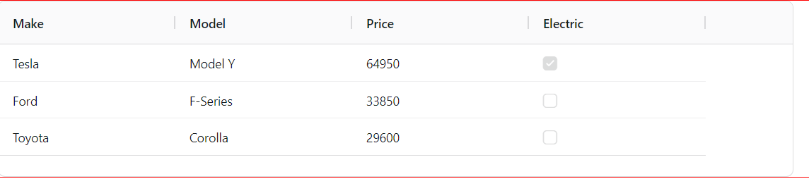
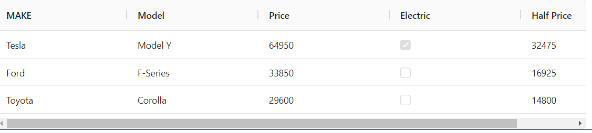
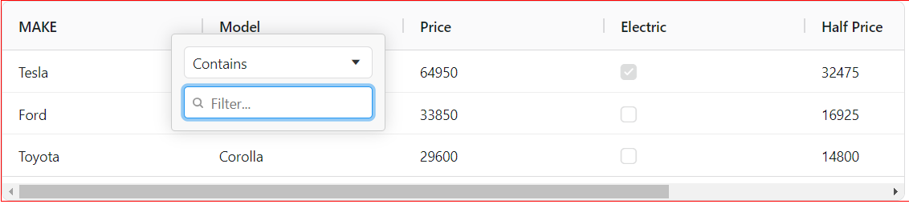
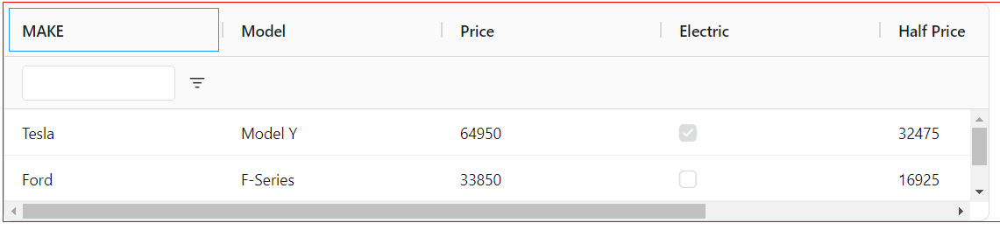
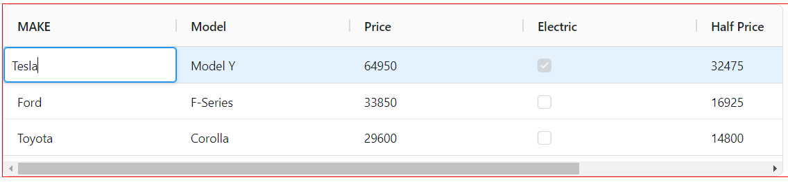
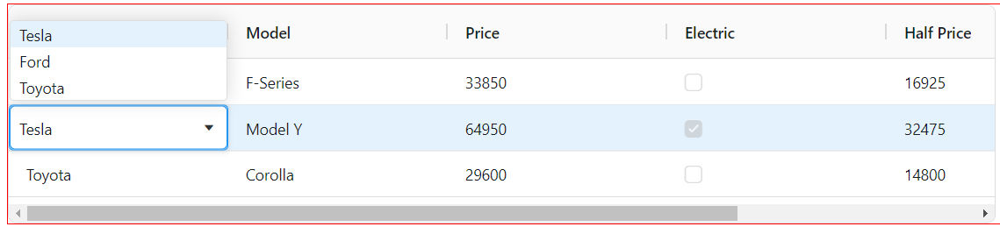

# REACT AG-GRID

### About:
- AG Grid is a JavaScript data grid that's used by developers to build enterprise applications. It's fully customizable, has high performance, and can handle millions of rows and thousands of updates per second. 
- AG Grid supports React, Angular, Vue, and Plain JavaScript. 
- It has a wide range of features, including:
    - Column interactions
    - Pagination
    - Sorting
    - Row selection
    - Grouping and aggregation
    - Accessibility support
    - Custom filtering
    - In-place cell editing
    - Records lazy loading
    - Server-side records operations
    - A suite of integrated charting tools

### Installation:

```javascript
npm install ag-grid-react
```
### Required Imports:

```JSX
import { AgGridReact } from "ag-grid-react"; // AG Grid Component
import "ag-grid-community/styles/ag-grid.css"; // Mandatory CSS required by the grid
import "ag-grid-community/styles/ag-theme-quartz.css"; // Optional Theme applied to the grid 

```

### Sample Code;

```JSX
import React from "react";
import { AgGridReact } from "ag-grid-react"; // AG Grid Component
import "ag-grid-community/styles/ag-grid.css"; // Mandatory CSS required by the grid
import "ag-grid-community/styles/ag-theme-quartz.css"; // Optional Theme applied to the grid 
const Table = () => {
  const [rowData, setRowData] = React.useState([
    { make: "Tesla", model: "Model Y", price: 64950, electric: true },
    { make: "Ford", model: "F-Series", price: 33850, electric: false },
    { make: "Toyota", model: "Corolla", price: 29600, electric: false },
  ]);
  const [colDefs, setColDefs] = React.useState([
    { field: "make" },
    { field: "model" },
    { field: "price" },
    { field: "electric" },
  ]);
  return (
    <div
      className="ag-theme-quartz" // applying the grid theme
      style={{ height: 200,width:900}} // the grid will fill the size of the parent container
    >
      <AgGridReact rowData={rowData} columnDefs={colDefs} />
    </div>
  );
};

export default Table;


```


### Showing Data:

#### headerName VS field:
- **headerName** is used to define the text displayed in the column header.
- **field** is used to specify which field from the data source should be displayed in the column.


#### valueGetter:
- The valueGetter function provides flexibility in how data is displayed within a column, allowing you to perform calculations, access nested properties, or apply custom logic as needed.
- **USECASE**: Let say you want to calculate the half price of each car.

```JSX 
const [colDefs, setColDefs] = React.useState([
    { headerName: "MAKE" ,field:"make" },
    { field: "model" },
    { field: "price" },
    { field: "electric" },
    { headerName:"Half Price",field: "price",valueGetter:(params)=>{return params.data.price/2} },
  ]);

```



#### Text Formatting

```JSX
const [columnDefs, setColumnDefs] = useState([
    { field: "price", valueFormatter: p => '£' + Math.floor(p.value).toLocaleString() },
]);

<AgGridReact columnDefs={columnDefs} /> 

```

#### Cell Components

- Helps you add buttons, checkboxes or images to cells with a Cell Component.

```JSX
const CustomButtonComponent = (props) => {
   return <button onClick={() => window.alert('clicked') }>Push Me!</button>;
 };

const [colDefs, setColDefs] = useState([
   { field: "button", cellRenderer: CustomButtonComponent },
   // ...
 ]); 

```

#### To Pass Data:

```JSX 
 const pushButtonFun=(data)=>{
    console.log(data.data);
  }
const CustomButtonComponent = (props) => {
    console.log('props', props)
    return <button onClick={() => pushButtonFun(props) }>Push Me!</button>;
  };
```

#### Resizing:
```JSX
const [columnDefs, setColumnDefs] = useState([
    { field: "make", flex: 2 }, //This column will be twice as wide as the others
    { field: "model", flex: 1 },
    { field: "price", flex: 1 },
    { field: "electric", flex: 1 }
]); 

```

### Working With Data:

#### Filter:
```JSX
{ field: "make", filter: true },
```



#### Floating Filter:

```JSX
 { field: "make", filter: true, floatingFilter: true }, 
```


#### Editing 
Enable Editing by setting the editable attribute to true. 

```JSX 
const [columnDefs, setColumnDefs] = useState([
    { field: "make", editable: true },
]);

<AgGridReact columnDefs={columnDefs} />
```


#### Advanced Editing:

```JSX
const [columnDefs, setColumnDefs] = useState([
    {
        field: "make",
        editable: true,
        cellEditor: 'agSelectCellEditor',
        cellEditorParams: {
            values: ['Tesla', 'Ford', 'Toyota'],
        },
    },
]);

<AgGridReact columnDefs={columnDefs} />

```


