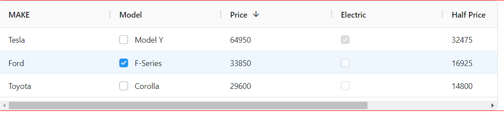
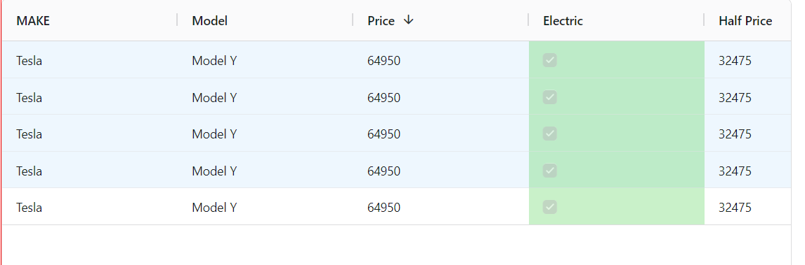
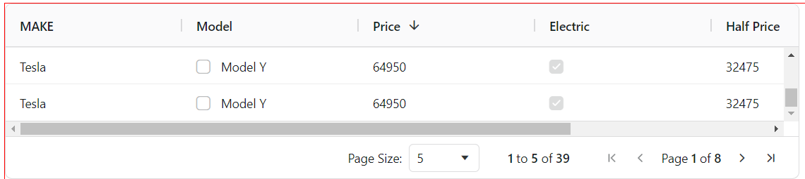
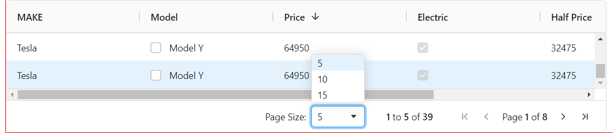

# REACT AG-GRID

### About:
- AG Grid is a JavaScript data grid that's used by developers to build enterprise applications. It's fully customizable, has high performance, and can handle millions of rows and thousands of updates per second. 
- AG Grid supports React, Angular, Vue, and Plain JavaScript. 
- It has a wide range of features, including:
    - Column interactions
    - Pagination
    - Sorting
    - Row selection
    - Grouping and aggregation
    - Accessibility support
    - Custom filtering
    - In-place cell editing
    - Records lazy loading
    - Server-side records operations
    - A suite of integrated charting tools

### Installation:

```javascript
npm install ag-grid-react
```
### Required Imports:

```JSX
import { AgGridReact } from "ag-grid-react"; // AG Grid Component
import "ag-grid-community/styles/ag-grid.css"; // Mandatory CSS required by the grid
import "ag-grid-community/styles/ag-theme-quartz.css"; // Optional Theme applied to the grid 

```

### Sample Code;

```JSX
import React from "react";
import { AgGridReact } from "ag-grid-react"; // AG Grid Component
import "ag-grid-community/styles/ag-grid.css"; // Mandatory CSS required by the grid
import "ag-grid-community/styles/ag-theme-quartz.css"; // Optional Theme applied to the grid 
const Table = () => {
  const [rowData, setRowData] = React.useState([
    { make: "Tesla", model: "Model Y", price: 64950, electric: true },
    { make: "Ford", model: "F-Series", price: 33850, electric: false },
    { make: "Toyota", model: "Corolla", price: 29600, electric: false },
  ]);
  const [colDefs, setColDefs] = React.useState([
    { field: "make" },
    { field: "model" },
    { field: "price" },
    { field: "electric" },
  ]);
  return (
    <div
      className="ag-theme-quartz" // applying the grid theme
      style={{ height: 200,width:900}} // the grid will fill the size of the parent container
    >
      <AgGridReact rowData={rowData} columnDefs={colDefs} />
    </div>
  );
};

export default Table;


```


### Showing Data:

#### headerName VS field:
- **headerName** is used to define the text displayed in the column header.
- **field** is used to specify which field from the data source should be displayed in the column.


#### valueGetter:
- The valueGetter function provides flexibility in how data is displayed within a column, allowing you to perform calculations, access nested properties, or apply custom logic as needed.
- **USECASE**: Let say you want to calculate the half price of each car.

```JSX 
const [colDefs, setColDefs] = React.useState([
    { headerName: "MAKE" ,field:"make" },
    { field: "model" },
    { field: "price" },
    { field: "electric" },
    { headerName:"Half Price",field: "price",valueGetter:(params)=>{return params.data.price/2} },
  ]);

```


#### Text Formatting

```JSX
const [columnDefs, setColumnDefs] = useState([
    { field: "price", valueFormatter: p => '£' + Math.floor(p.value).toLocaleString() },
]);

<AgGridReact columnDefs={columnDefs} /> 

```

#### Cell Components

- Helps you add buttons, checkboxes or images to cells with a Cell Component.

```JSX
const CustomButtonComponent = (props) => {
   return <button onClick={() => window.alert('clicked') }>Push Me!</button>;
 };

const [colDefs, setColDefs] = useState([
   { field: "button", cellRenderer: CustomButtonComponent },
   // ...
 ]); 

```

#### To Pass Data:

```JSX 
 const pushButtonFun=(data)=>{
    console.log(data.data);
  }
const CustomButtonComponent = (props) => {
    console.log('props', props)
    return <button onClick={() => pushButtonFun(props) }>Push Me!</button>;
  };
```

#### Resizing:
```JSX
const [columnDefs, setColumnDefs] = useState([
    { field: "make", flex: 2 }, //This column will be twice as wide as the others
    { field: "model", flex: 1 },
    { field: "price", flex: 1 },
    { field: "electric", flex: 1 }
]); 

```

### Working With Data:

#### Filter:
```JSX
{ field: "make", filter: true },
```


#### Floating Filter:

```JSX
 { field: "make", filter: true, floatingFilter: true }, 
```


#### Editing 
Enable Editing by setting the editable attribute to true. 

```JSX 
const [columnDefs, setColumnDefs] = useState([
    { field: "make", editable: true },
]);

<AgGridReact columnDefs={columnDefs} />
```


#### Advanced Editing:

```JSX
const [columnDefs, setColumnDefs] = useState([
    {
        field: "make",
        editable: true,
        cellEditor: 'agSelectCellEditor',
        cellEditorParams: {
            values: ['Tesla', 'Ford', 'Toyota'],
        },
    },
]);

<AgGridReact columnDefs={columnDefs} />

```


#### Sorting 
- Data is Sorted by clicking the column headers. Sorting is enabled by default.
- But if you want to have desc by default.

```JSX
 { field: "price" ,sort: 'desc' }, 
```

#### Row Selection:

- Checkbox will be placed for each item of a particular coloumn.
    - single
    - multiple

```JSX 
{ field: "model", checkboxSelection: true },

 <AgGridReact rowData={rowData} columnDefs={colDefs} rowSelection="single" />
```


OR 

- If you donot want the checkbox to select just use

```html
 <AgGridReact rowData={rowData} columnDefs={colDefs} rowSelection="single" />

```


#### Pagination:

- Enable Pagination by setting the value to `true`
- This will bring that pagination button bottom of the table.

```html
    <AgGridReact  pagination={true} rowData={rowData} columnDefs={colDefs} rowSelection="multiple" />
```


- **paginationPageSize**- will define how many row should be rendered on the page.

```html
<AgGridReact pagination={pagination} paginationPageSize={5} rowData={rowData} columnDefs={colDefs} rowSelection="single" />
```

**paginationPageSizeSelector** - this will define how many items can be defined in the popup. here you need to pass an array as value.

```html

<AgGridReact pagination={pagination} paginationPageSize={5} paginationPageSizeSelector={[5,10,15]} rowData={rowData} columnDefs={colDefs} rowSelection="single" />

```


### Themes & Style 

- Manipulate the styles by.

```html
import "ag-grid-community/styles/ag-theme-quartz.css"; // import Quartz theme
// import "ag-grid-community/styles/ag-theme-alpine.css"; // import Alpine theme, not used here
...
return (
 <div class="ag-theme-quartz"> // set Quartz Theme on parent div
   <AgGridReact rowData={...} columnDefs={...} />
 </div>
) 

```

```css
.ag-theme-quartz {
    /* Changes the color of the grid text */
      --ag-foreground-color: rgb(14, 68, 145);
      /* Changes the color of the grid background */
      --ag-background-color: rgba(241, 247, 255);
      /* Changes the header color of the top row */
      --ag-header-background-color: rgba(228, 237, 250);
      /* Changes the hover color of the row*/
      --ag-row-hover-color: rgba(0, 38, 255, 0.1);
} 

```

#### Conditional Cell Styling:

```css
.rag-green {
    background-color: #33cc3344;
  } 
```
```jsx
const [columnDefs, setColumnDefs] = useState([{
    field: 'electric',
    cellClassRules: {
        // apply green to electric cars
        'rag-green': params => params.value === true,
    }
}]);

<AgGridReact columnDefs={columnDefs} /> 

```

#### Conditional Row Styling:

```css
.rag-red {
  background-color: #cc222244;
} 
```
```jsx 
const rowClassRules = {
    // apply red to Ford cars
    'rag-red': params => params.data.make === 'Ford',
};

<AgGridReact rowClassRules={rowClassRules} />
```